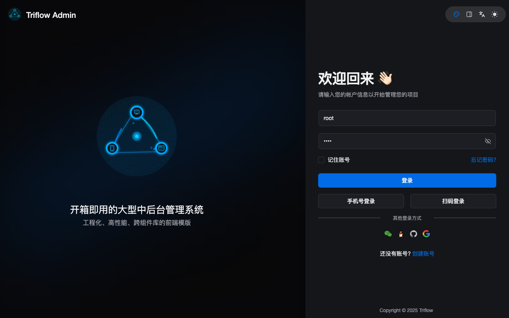
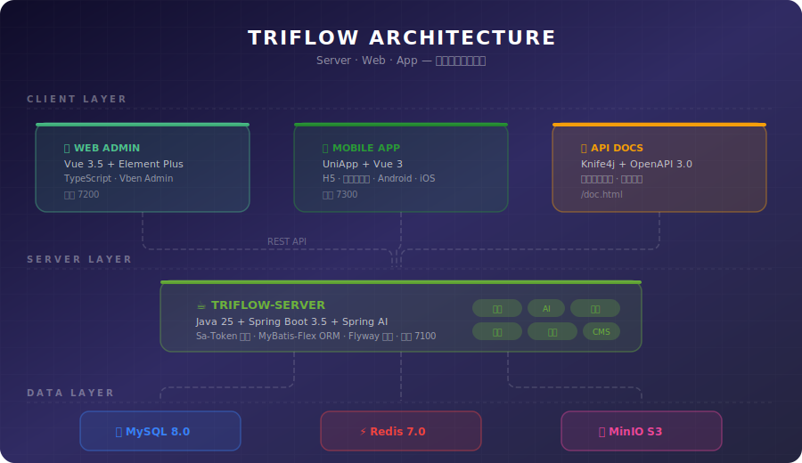
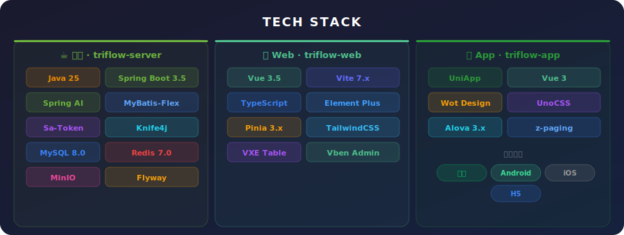
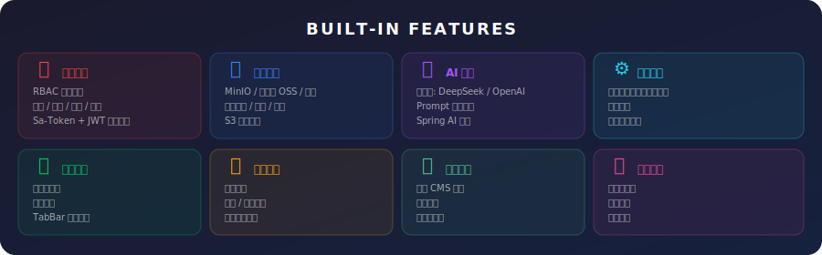
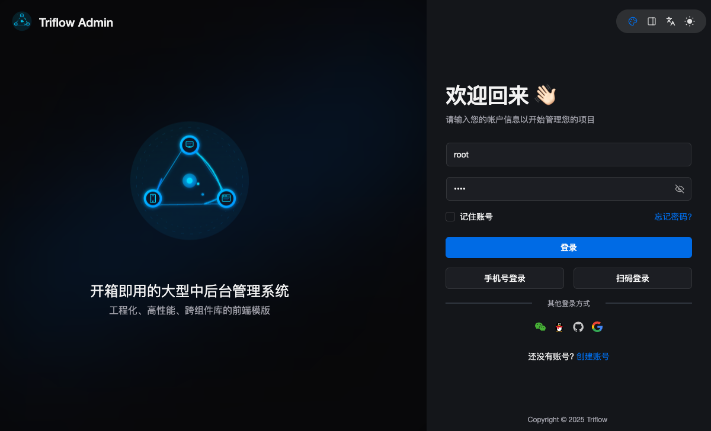
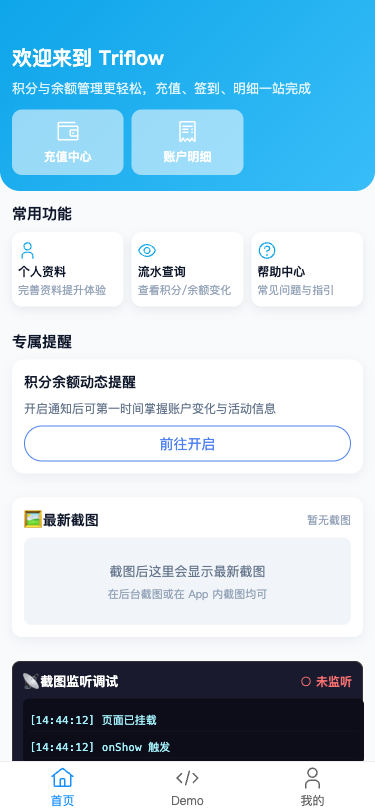
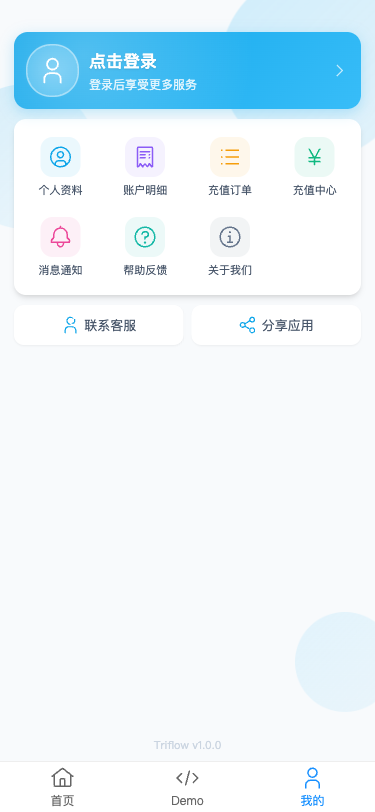

<div align="center">


# Triflow

**Tri**（三端）+ **Flow**（流动）— 面向 Server / Web / App 三端的企业级全栈开发脚手架

让数据在各端之间流畅互通，开箱即用、一键部署

---

[](https://openjdk.org/)
[](https://spring.io/projects/spring-boot)
[](https://vuejs.org/)
[](https://uniapp.dcloud.net.cn/)
[](LICENSE)
[](#-快速部署)

</div>

<br>

<p align="center">
  
</p>

---

## 🌟 项目介绍

Triflow 是一个**生产就绪**的三端全栈开发脚手架，致力于为企业和独立开发者提供一套「开箱即用」的全栈解决方案。

- **后端** — Java 25 + Spring Boot 3.5，模块化设计，内置权限、AI、文件管理等通用能力
- **Web 端** — Vue 3.5 + Element Plus + TypeScript，基于 Vben Admin 的现代化管理后台
- **移动端** — UniApp + Vue 3，一套代码同时生成微信小程序 / Android / iOS / H5

### 系统架构

<p align="center">
  
</p>

---

## 🛠 技术栈

<p align="center">
  
</p>

### 后端 · triflow-server

| 技术 | 版本 | 说明 |
|:---|:---:|:---|
| Java | 25 | 支持虚拟线程、模式匹配等现代特性 |
| Spring Boot | 3.5+ | 核心框架 |
| Spring AI | 1.0+ | AI 能力集成（多模型路由） |
| MyBatis-Flex | 1.10+ | 轻量级 ORM，链式查询 |
| Sa-Token | 1.44+ | 权限认证 + JWT |
| MySQL | 8.0+ | 关系数据库 |
| Redis | 7.0+ | 缓存 + 会话管理 |
| MinIO | Latest | S3 兼容对象存储 |
| Knife4j | 4.5+ | API 文档（OpenAPI 3.0） |
| Flyway | 11+ | 数据库版本迁移 |

### Web 端 · triflow-web

| 技术 | 版本 | 说明 |
|:---|:---:|:---|
| Vue | 3.5+ | 组合式 API + `<script setup>` |
| Vite | 7.x | 下一代前端构建工具 |
| TypeScript | 5.x | 类型安全 |
| Element Plus | 2.x | UI 组件库 |
| Pinia | 3.x | 状态管理 |
| TailwindCSS | 3.x | 原子化 CSS |
| VXE Table | 4.x | 高性能表格 |

> 基于 [Vue Vben Admin](https://github.com/vbenjs/vue-vben-admin) 二次开发

### 移动端 · triflow-app

| 技术 | 版本 | 说明 |
|:---|:---:|:---|
| UniApp | Vue 3 | 跨端框架 |
| Wot Design Uni | Latest | 移动端 UI 组件库 |
| UnoCSS | Latest | 原子化 CSS |
| Alova | 3.x | 请求库 |
| z-paging | 2.x | 分页滚动组件 |

**支持平台** — 微信小程序 / Android / iOS / H5

> 基于 [unibest](https://github.com/feige996/unibest) 二次开发

---

## ✨ 内置功能

<p align="center">
  
</p>

<table>
<tr>
<td width="50%">

**🔐 权限管理**
- 用户 / 角色 / 部门 / 菜单管理
- RBAC 权限模型 + 按钮级权限
- Sa-Token + JWT 双重鉴权

</td>
<td width="50%">

**📂 文件管理**
- 多存储后端：MinIO / 阿里云 OSS / 本地
- 文件上传 / 预览 / 下载
- S3 兼容协议

</td>
</tr>
<tr>
<td>

**🤖 AI 管理**
- 多模型路由：DeepSeek / OpenAI / Claude / 智谱
- Prompt 模板管理
- Spring AI 集成

</td>
<td>

**⚙️ 系统配置**
- 动态配置管理（键值对）
- 功能开关
- 操作日志审计

</td>
</tr>
<tr>
<td>

**💬 微信集成**
- 小程序登录
- 微信支付
- TabBar 动态配置

</td>
<td>

**💰 钱包系统**
- 用户积分
- 充值 / 交易记录
- 多种支付渠道

</td>
</tr>
<tr>
<td>

**📝 内容管理**
- 文章 CMS 管理
- 分类体系
- 富文本编辑

</td>
<td>

**📊 数据报表**
- 仪表盘概览
- 用户统计
- 系统监控

</td>
</tr>
</table>

---

## 🖼 界面预览

<table>
<tr>
<td width="65%" align="center">

**Web 管理后台 — 登录页**



</td>
<td width="35%" align="center">

**移动端 H5 — 首页**



</td>
</tr>
<tr>
<td align="center">

<sub>Vue 3.5 + Element Plus · 深色/浅色主题 · 多语言支持</sub>

</td>
<td align="center">

<sub>UniApp + Wot Design · 微信/Android/iOS/H5 多端</sub>

</td>
</tr>
</table>

<details>
<summary><b>更多截图</b></summary>

<br>

| 移动端 - 我的页面 |
|:---:|
|  |
| <sub>个人中心 · 功能入口 · 联系客服</sub> |

</details>

---

## 🚀 快速部署

只需一条命令，自动完成构建和启动。

### 方式一：All-in-One 单容器 <sub>推荐体验</sub>

所有服务打包在单个 Docker 容器中，最简单的一键体验方式：

```bash
git clone git@github.com:glowxq/triflow.git
cd triflow
chmod +x deploy-all-in-one.sh
./deploy-all-in-one.sh start
```

启动完成后访问 **http://localhost:7200** ，使用 `root / root` 登录。

### 方式二：Docker Compose 多容器

各服务独立容器运行，适合开发和生产环境：

```bash
git clone git@github.com:glowxq/triflow.git
cd triflow
chmod +x deploy.sh
./deploy.sh start
```

### 🔗 服务地址

| 服务 | All-in-One | Docker Compose | 说明 |
|:---:|:---:|:---:|:---|
| 管理后台 | [localhost:7200](http://localhost:7200) | [localhost:7200](http://localhost:7200) | 账号 `root` / `root` |
| H5 移动端 | [localhost:7200/h5/](http://localhost:7200/h5/) | — | 仅 All-in-One |
| 后端 API | [localhost:7200/api/](http://localhost:7200/api/) | [localhost:7100](http://localhost:7100) | RESTful 接口 |
| API 文档 | [localhost:7200/api/doc.html](http://localhost:7200/api/doc.html) | [localhost:7100/doc.html](http://localhost:7100/doc.html) | Knife4j / OpenAPI 3 |
| MinIO 控制台 | — | [localhost:9001](http://localhost:9001) | 账号 `triflow` / `triflow123` |

### 📋 管理命令

```bash
./deploy.sh start       # 启动服务（首次自动构建镜像）
./deploy.sh stop        # 停止服务
./deploy.sh restart     # 重启服务
./deploy.sh status      # 查看运行状态
./deploy.sh logs        # 查看实时日志
./deploy.sh clean       # 清理数据卷（谨慎操作）
```

> 首次启动需构建 Docker 镜像，约需 5 ~ 10 分钟。后续启动使用缓存，秒级完成。
>
> 更多部署细节请参阅 [部署文档](docs/deployment.md)。

---

## 📁 项目结构

```
triflow/
│
├── triflow-server/              # ☕ Java 后端服务
│   ├── base/                    #   启动模块（端口 7100）
│   ├── common/                  #   公共模块
│   │   ├── common-core          #     核心工具
│   │   ├── common-security      #     安全认证（Sa-Token）
│   │   ├── common-db-mysql      #     数据库（MyBatis-Flex）
│   │   ├── common-db-redis      #     缓存（Redis）
│   │   ├── common-oss           #     对象存储（MinIO / OSS）
│   │   ├── common-ai            #     AI 能力（Spring AI）
│   │   ├── common-excel         #     Excel 导入导出
│   │   ├── common-log           #     操作日志
│   │   ├── common-sms           #     短信服务
│   │   ├── common-wechat        #     微信集成
│   │   └── common-business      #     业务公共
│   ├── business/                #   业务模块
│   └── dependencies/            #   依赖管理（BOM）
│
├── triflow-web/                 # 🖥 Vue Web 管理后台
│   ├── apps/web-admin/          #   后台管理系统
│   └── packages/                #   共享组件 / 工具包
│
├── triflow-app/                 # 📱 UniApp 多端应用
│   ├── src/                     #   源代码
│   └── env/                     #   多环境配置
│
├── docker/                      # 🐳 Docker 配置
│   ├── all-in-one/              #   All-in-One 单容器配置
│   ├── mysql/init.sql           #   数据库初始化脚本
│   └── nginx/                   #   Nginx 反向代理配置
│
├── scripts/                     # 🔧 开发脚本
│   └── start.sh                 #   一键启动脚本（本地开发）
│
├── deploy.sh                    #   Docker Compose 部署脚本
├── deploy-all-in-one.sh         #   All-in-One 单容器部署脚本
├── docker-compose.yml           #   Docker Compose 编排文件
└── .env.example                 #   环境变量模板
```

---

## 💻 本地开发

如果不使用 Docker，可手动启动各模块进行开发调试。

### 环境要求

| 工具 | 版本 | 用途 |
|:---|:---:|:---|
| JDK | 25 | 后端编译运行 |
| Maven | 3.9+ | Java 依赖管理 |
| Node.js | 20.12+ | 前端运行时 |
| pnpm | 10+ | 前端包管理器 |
| MySQL | 8.0+ | 数据库 |
| Redis | 7.0+ | 缓存 |

### 快速启动

**一键启动（推荐）**

```bash
# 启动所有服务
./scripts/start.sh

# 启动指定服务
./scripts/start.sh server web:admin    # 后端 + Web 管理后台
./scripts/start.sh server app:h5       # 后端 + App H5

# 查看状态 / 停止
./scripts/start.sh status
./scripts/start.sh stop
```

**手动启动**

```bash
# 后端（端口 7100）
cd triflow-server
mvn clean install -DskipTests
mvn -pl base spring-boot:run -Dspring-boot.run.profiles=local

# Web 管理后台（端口 7200）
cd triflow-web
pnpm install && pnpm dev:admin

# 移动端 H5（端口 7300）
cd triflow-app
pnpm install && pnpm dev:h5
```

> 详细开发配置请参阅 [开发文档](docs/development.md)。

---

## 📖 文档导航

| 文档 | 说明 |
|:---|:---|
| [部署指南](docs/deployment.md) | Docker 部署详细说明、自定义配置、故障排查 |
| [开发指南](docs/development.md) | 本地开发环境搭建、各端启动方式、IDE 配置 |
| [架构说明](docs/architecture.md) | 项目分层架构、模块职责、设计理念 |
| [App 打包指南](docs/app-build.md) | Android APK / iOS IPA 打包流程 |

---

## 🤝 参与贡献

欢迎提交 Pull Request 或 Issue！参与贡献前请阅读以下内容：

1. **Fork** 本仓库
2. 创建你的特性分支 `git checkout -b feature/amazing-feature`
3. 提交你的修改 `git commit -m 'feat: add amazing feature'`
4. 推送到分支 `git push origin feature/amazing-feature`
5. 提交 **Pull Request**

### 提交规范

本项目使用 [Conventional Commits](https://www.conventionalcommits.org/) 规范：

| 前缀 | 说明 | 示例 |
|:---|:---|:---|
| `feat` | 新功能 | `feat: 新增用户导出功能` |
| `fix` | 修复 Bug | `fix: 修复登录失败问题` |
| `docs` | 文档变更 | `docs: 更新部署文档` |
| `style` | 代码格式 | `style: 格式化代码` |
| `refactor` | 重构 | `refactor: 重构权限模块` |
| `chore` | 构建 / 工具 | `chore: 更新依赖版本` |

---

## 📄 开源协议

本项目基于 [Apache License 2.0](LICENSE) 开源协议发布。

---

## 🙏 致谢

感谢以下优秀的开源项目，Triflow 站在巨人的肩膀上：

**后端** — [Spring Boot](https://spring.io/projects/spring-boot) / [Sa-Token](https://sa-token.cc/) / [MyBatis-Flex](https://mybatis-flex.com/) / [Knife4j](https://doc.xiaominfo.com/) / [Spring AI](https://spring.io/projects/spring-ai) / [SZAdmin](https://szadmin.cn/)

**Web 端** — [Vue Vben Admin](https://github.com/vbenjs/vue-vben-admin) / [Vue.js](https://vuejs.org/) / [Element Plus](https://element-plus.org/) / [Vite](https://vite.dev/)

**移动端** — [unibest](https://github.com/feige996/unibest) / [UniApp](https://uniapp.dcloud.net.cn/) / [Wot Design Uni](https://wot-design-uni.netlify.app/)

---

<div align="center">

**如果觉得 Triflow 对你有帮助，请给一个 Star 吧！**

<sub>Made with ❤️ by <a href="https://github.com/glowxq">glowxq</a></sub>

</div>
